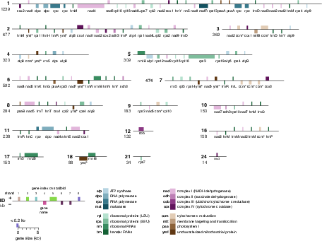

[GitHub](https://github.com/sjackman)
— [Twitter](http://twitter.com/sjackman)
— [Google Scholar](http://scholar.google.ca/citations?user=wFl3qXAAAAAJ)
— [Impactstory](https://impactstory.org/sjackman)
— [LinkedIn](http://www.linkedin.com/in/sjackman)
— [Resume](http://sjackman.ca/resume)
  [(PDF)](https://www.dropbox.com/s/d7mdj806squlmwz/Shaun%20Jackman.pdf)  
<sjackman@gmail.com>

I live in Vancouver, Canada, where I'm a PhD candidate studying bioinformatics at the University of British Columbia with my supervisor, Inanc Birol. I work
with the genome sequencing data of a variety of species, including human and
the white spruce tree. I develop software that takes fragmented genome
sequencing data and attempts to reassemble the original genome from which the
short fragments were derived. My undergraduate degree is in computer
engineering. I'm a programmer, an avid traveller, a singer, and an experimental
amateur chef.

My research
================================================================================

(explained using only the ten hundred words people use most often)

[How to Read the Written Plan of Living Cells](http://splasho.com/upgoer5/?i=PxuiqlO0olOFMJSxVUEbMFOKpzy0qTIhVSOfLJ4to2LtGTy2nJ5aVRAyoTkmPtcHnTHtq3WcqUEyovOjoTShVT9zVTkcqzyhMlOwMJkfplOcplO2MKW5VTkupzqyYvOQo21jqKEypaZtpzIuMPO0nTImMFOjoTShpljtLaI0VUEbMKxtLKWyVT5iqPO2MKW5VTqio2DtLKDtnKDhVSEbMKxtpzIuMPOfo3EmVT9zVUAgLJkfVTkcqUEfMFOvnKEmVT9zVUEbMFO3pzy0qTIhVUOfLJ4tLKDtLFO0nJ1yYPOuozDtqTuuqPOgLJgyplOfo3EmVT9zVUOlo2WfMJ1mYvOWVT1un2HtLFOwo21jqKEypvO0nTyhMlO0nTS0VUEun2ImVUEbMFOmoJSfoPOfnKE0oTHtLzy0plOiMvO0nTHtq3WcqUEyovOjoTShVTShMPOjqKEmVUEbMJ0tqT9aMKEbMKVtnJ50olOfLKWaMKVtLzy0pl4tHTIipTkyVTkio2ftqTulo3IanPO0nTImMFOfLKWaMKVtLzy0pljtLzIwLKImMFOcqPqmVTIup2yypvO0nTShVUImnJ5aVUEbMFOmoJSfoPOvnKEmYPO0olOfo29eVTMipvOcoaEypzImqTyhMlOmqUIzMvOcovO0nTIlMFOuozDtoTIupz4toJ9lMFOuLz91qPOfnKMcozptL2IfoUZhPtb=)
------------------------------------------------------------

> The written plan of living cells is very large. Computers read these plans, but they are not very good at it. They read lots of small little bits of the written plan at a time, and that makes lots of problems. I make a computer thing that takes the small little bits of the written plan and puts them together into larger bits. People look through these larger bits, because it's easier than using the small bits, to look for interesting stuff in there and learn more about living cells.

Written using [The Up Goer Five Text Editor](http://splasho.com/upgoer5/) and inspired by Keith Bradnam's blog post [How would you describe genomics without using any scientific jargon?](http://www.acgt.me/blog/2016/2/26/how-would-you-describe-genomics-without-using-any-scientific-jargon) and Randall Munroe's excellent [xkcd: Up Goer Five](https://xkcd.com/1133/).

Projects
========

Organellar Genomes of White Spruce
----------------------------------

Chloroplast genomes of gymnosperms, including conifers, are well studied, but little is known about the mitochondria of gymnosperms. In fact, only a single gymnosperm mitochondrion is found in NCBI GenBank, and no conifer mitochondrion genomes are to be found at all, until now. Roughly one percent of the whole genome sequencing reads of white spruce are from its two organellar genomes: the chloroplast and mitochondrion. We assembled these reads using [ABySS][] and found the mitochondrion genome to be nearly six megabases, which is unusually large for a mitochondrial genome. Although many genes typical of mitochondria were found in the genome, most open reading frames had no similarity to any known gene.

Shaun D Jackman, et al. (2016)
Organellar Genomes of White Spruce (*Picea glauca*): Assembly and Annotation.
*Genome Biology and Evolution*, [doi:10.1093/gbe/evv244](http://gbe.oxfordjournals.org/content/8/1/29)

GitHub repositories: [pgcpdna](https://github.com/sjackman/pgcpdna), [pgmtdna](https://github.com/sjackman/pgmtdna)

**The genes of the white spruce mitochondrion**

UniqTag
-------

[UniqTag][] is used to abbreviate gene sequences to unique and stable
identifiers. It selects a representative *k*-mer from the sequence of each gene
to be used as a systematic identifier for that gene. Unlike serial numbers,
these identifiers are stable between different assemblies and annotations of
the same data without requiring that previous annotations be lifted over by
sequence alignment.

[Shaun D. Jackman, Joerg Bohlmann, İnanç Birol (2015)][uniqtag-paper]
UniqTag: Content-derived unique and stable identifiers for gene annotation.
*PLOS ONE*, [doi:10.1371/journal.pone.0128026](http://dx.doi.org/10.1371/journal.pone.0128026).

[UniqTag]: https://github.com/sjackman/uniqtag
[uniqtag-paper]: https://github.com/sjackman/uniqtag-paper

ABySS
-----

[ABySS][] is a genome sequence assembler that distributes the computation of
large genome sequence assembly over a cluster of computers using MPI.

[ABySS]: https://github.com/bcgsc/abyss

White spruce genome sequence assembly
-------------------------------------

The [SMarTForests][] project used [ABySS][] to assemble the genome of the white
spruce tree, which is twenty gigabases&mdash;seven times larger than the human
genome. I'm currently working on assembling and annotating the organellar
genomes of white spruce, the mitochondrion and chloroplast.

[SMarTForests]: http://www.smartforests.ca/

Presentations
================================================================================

## [Automating Data-analysis Pipelines using R and Make](http://stat545-ubc.github.io/automation01_slides/)

and a [hands-on activity](http://stat545-ubc.github.io/automation04_make-activity.html)

> 'Automating' comes from the roots 'auto-' meaning 'self-', and 'mating', meaning 'screwing'.

Bioinformatics analysis often involves designing a pipeline of commands and running that pipeline on many data sets. There are many ways to tackle this common task. Running commands interactively at the command line has the downside of being terribly unreproducible, unless one's memory is fantastically infallible. Recording the commands in a shell script certainly beats storing the commands in one's leaky brain, but is not particularly well suited to resuming the pipeline at a particular point, as is necessary after making a change to one step of the pipeline, nor to running independents steps in parallel. The venerable UNIX Make program is surprisingly well suited to describing bioinformatics pipelines. Make can resume a pipeline after a failed command without needing to start over, and it runs independent jobs in parallel. A Makefile describes a pipeline of shell commands and the interdependencies of the input and output files of those commands. A Makefile can be easily displayed as a graphical flow chart of files and shell commands, and such a visualization is a pleasing and powerful way to interpret a pipeline oneself or to communicate a pipeline to a collaborator.

## [Open, reproducible science using Make, RMarkdown and Pandoc](http://sjackman.github.io/open-science/)

## More slides on [Speaker Deck][] and [SlideShare][]

[SlideShare]: http://www.slideshare.net/shaunjackman
[Speaker Deck]: https://speakerdeck.com/sjackman
